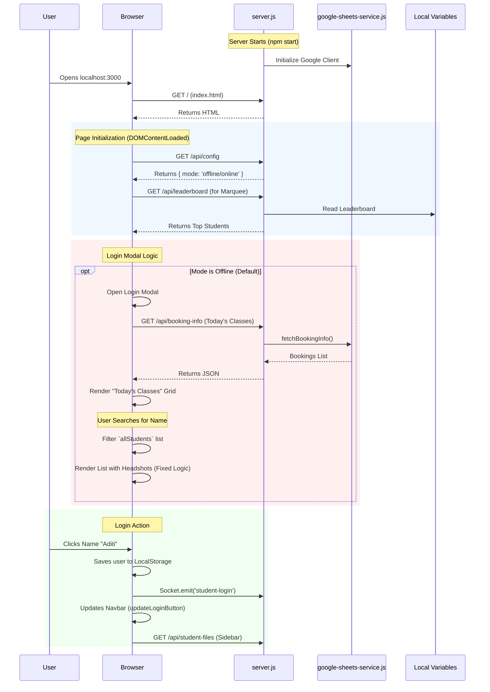

# Project Documentation

## File Structure Note (2026-01-26)
All utility, debug, and verification scripts have been moved to the `scripts/` directory to declutter the root.
**Running Scripts:**
Instead of `node debug_drive.js`, use: `node scripts/debug_drive.js`.

## File Inventory & Functions

### Core Server
*   `server.js`: **MAIN ENTRY POINT**. Express web server. Handles API endpoints (`/api/...`), static file serving, and WebSocket connections (Socket.io).
*   `google-sheets-service.js`: **DATA LAYER**. Handles all Google Sheets interactions (Auth, Read, Write). Caches data (students, projects, bookings) to minimize API quotas.
*   `google-sheets-config.js`: Configuration for Sheets (Sheet IDs, column mappings).
*   `analytics-service.js`: Logs system events and usage stats.

### Frontend (Main Pages)
*   `public/index.html`: **HOMEPAGE**. Contains the Main Login Modal, Project Dashboard, and "Today's Classes" logic.

*   `public/student-progress.html`: Detailed view of a student's history and current work.
*   `public/leaderboard.html`: Displays student points and rankings (Marquee logic).
*   `public/project.html`: Individual project instructions page.
*   `public/search.html`: (Legacy?) Search functionality.

### Frontend Logic (Scripts)
*   `public/mobile-nav.js`: Manages the responsive navigation bar and global UI state (Login/Logout pills).
*   `public/mode-indicator.js`: Visual indicator for "Online" vs "Offline" mode.
*   `public/analytics.js`: Client-side logging helper.

### Configuration & Utilities
*   `package.json`: Dependencies and start scripts.
*   `.env`: Environment variables (Secrets).
*   `START_SERVER.bat`: Windows startup script.

---

## Site Load Flow (Chronological)

## Key Sync Functions (server.js)
1.  **Headshots First**: `/api/admin/sync-all` and `/api/sync-students` now prioritize `syncHeadshots()` to ensure images exist on disk before mapping.
2.  **Name Mapping**: `fetchStudents` prioritizes Column C (Full Name) over Column B (Short Name).
3.  **Frontend Display**: `index.html` logic handles absolute `/headshots/` paths correctly to prevent 404s.
